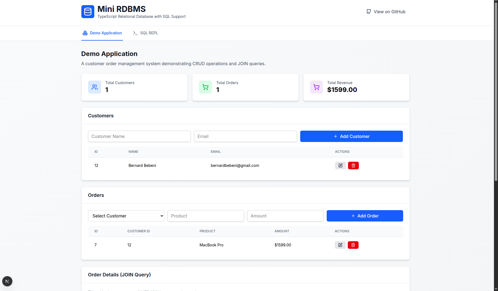
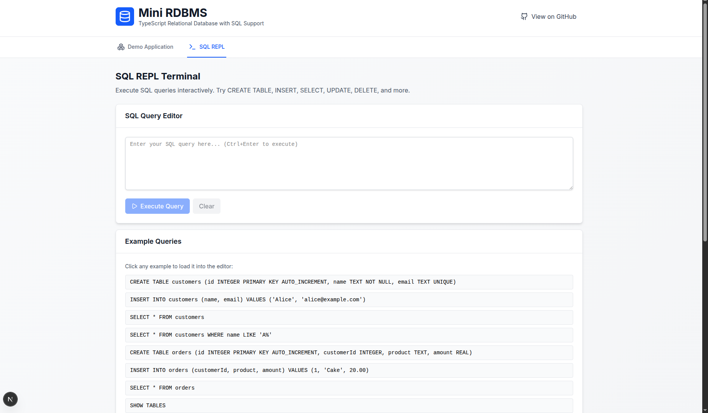

# Mini RDBMS - Relational Database Management System

A TypeScript implementation of a relational database management system with SQL interface, built as a Next.js web application. This project demonstrates CRUD operations, basic indexing, primary/unique key constraints, and an interactive SQL REPL.

## Live Demo

[View Live Demo](https://mini-rdbms.vercel.app/)

## Features

- **SQL Parser**: Custom SQL parser supporting DDL and DML operations
- **Database Backend**: PostgreSQL with Prisma ORM
- **Interactive REPL**: Browser-based SQL query editor with history
- **Web Demo**: Customer and order management application
- **REST API**: Full CRUD operations via REST endpoints
- **Type Safety**: Full TypeScript implementation

## Tech Stack

- **Frontend**: Next.js 14, React, Tailwind CSS, RTK Query
- **Backend**: Next.js API Routes, Prisma ORM
- **Database**: PostgreSQL
- **Language**: TypeScript

## Getting Started

### Prerequisites

- Node.js 18+
- PostgreSQL database

### Installation

1. Clone the repository and install dependencies:

```bash
npm install
```

2. Set up your PostgreSQL database and update the connection string in your environment variables.

3. Run database migrations:

```bash
npx prisma migrate dev
```

4. Start the development server:

```bash
npm run dev
```

5. Open [http://localhost:3000](http://localhost:3000) to view the application.

## Usage

The application provides two main interfaces:

### Web Demo

- **Customer Management**: Add, edit, and delete customers
- **Order Management**: Create orders linked to customers
- **Data Visualization**: View joined customer-order data

### SQL REPL

- **Interactive Queries**: Execute SQL commands directly
- **Supported Operations**: SELECT, INSERT, UPDATE, DELETE for customers and orders tables
- **Query History**: View previous queries and results
- **Example Queries**: Pre-loaded sample SQL statements

### Supported SQL Operations

```sql
-- View all customers
SELECT * FROM customers;

-- Add a new customer
INSERT INTO customers (name, email) VALUES ('John Doe', 'john@example.com');

-- Update customer information
UPDATE customers SET name = 'Jane Doe' WHERE id = 1;

-- Delete a customer (also deletes associated orders)
DELETE FROM customers WHERE id = 1;

-- View all orders
SELECT * FROM orders;
```

## Screenshots

### Demo Application


### SQL REPL Terminal


## Project Structure

See `CHALLENGE.md` for detailed documentation on the implementation and architecture.

## Learn More

To learn more about Next.js, take a look at the following resources:

- [Next.js Documentation](https://nextjs.org/docs) - learn about Next.js features and API.
- [Learn Next.js](https://nextjs.org/learn) - an interactive Next.js tutorial.

You can check out [the Next.js GitHub repository](https://github.com/vercel/next.js) - your feedback and contributions are welcome!

## Deploy on Vercel

The easiest way to deploy your Next.js app is to use the [Vercel Platform](https://vercel.com/new?utm_medium=default-template&filter=next.js&utm_source=create-next-app&utm_campaign=create-next-app-readme) from the creators of Next.js.

Check out our [Next.js deployment documentation](https://nextjs.org/docs/app/building-your-application/deploying) for more details.
